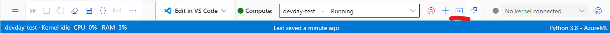
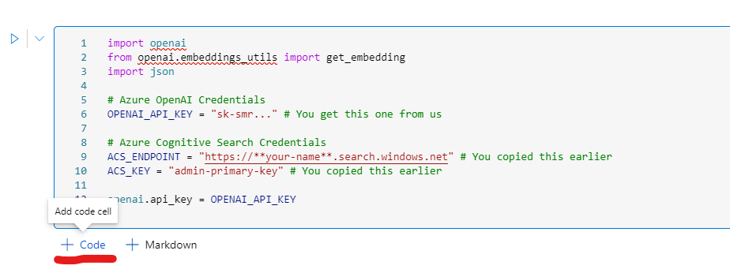

# Lab 2 - Data and Embeddings

**In this lab, you'll create a notebook in your Azure Machine Learning Workspace that uses Cognitive Search and OpenAI to answer questions about a simple dataset**

## Prerequisites

Lab 1

>**What is a notebook?**
>A notebook is a file where snippets of code can be run and results can be printed. Notebooks are often used in data science.

## Notebook setup

Go to [your machine learning portal](https://ml.azure.com/) and select **Notebooks** from the menu.
Create a new file by clicking **+Add Files**. Give your file a name and make sure it is of type **Notebook (*.ipynb)**. You will see that you can add code, or a new code cell or markdown.

## Setup imports and credentials

First you need to run the following commands in the command line. To get a terminal click on the terminal icon.



Now execute the following commands.

``` cmd
pip install openai
pip install azure-search-documents==11.4.0b8
```

In the first code cell we import some required packages and set some urls and credentials. First select the correct runtime **Python 3.8 - AzureML** from the dropdown on the to right. Then copy the following code and try to run it by clicking on **run cell** on the left of the code.

``` python
import openai
from openai.embeddings_utils import get_embedding
import json

# Azure OpenAI Credentials
OPENAI_API_KEY = "sk-smr..." # You get this one from us

# Azure Cognitive Search Credentials
ACS_ENDPOINT = "https://**your-name**.search.windows.net" # You copied this earlier
ACS_KEY = "admin-primary-key" # You copied this earlier

openai.api_key = OPENAI_API_KEY
```

## Load the Hotel data and generate embeddings

>**What is an embedding?**
>OpenAI’s text embeddings measure the relatedness of text strings. Embeddings are commonly used for search, clustering, recommendations, anomaly detection, diversity measurement and classification.
An embedding is a vector (list) of floating point numbers. The distance between two vectors measures their relatedness. Small distances suggest high relatedness and large distances suggest low relatedness. For more information, see [the documentation](https://platform.openai.com/docs/guides/embeddings/what-are-embeddings).

In this first step we will:

* Load the json data from file
* Create the embeddings

Create a new code cell (repeat this for each code block).



``` python
file_path = "hotels.json"
engine = "text-embedding-ada-002"

with open(file_path, 'r') as file:  
    text = file.read()  

hotels = json.loads(text)

for hotel in hotels:
    print(hotel['hotelname'])

    # Creating the text for the embedding
    text_for_embedding = "Name: "+hotel['hotelname']+" " \
            +"Price min: "+str(hotel['pricemin'])+" euro max: "+str(hotel['pricemax'])+" euro " \
            +"Location: City: "+hotel['city']+" Country: "+hotel['country']+" " \
            +"Features of the hotel: "+hotel['features']+" " \
            +"Description: "+hotel['description']
    hotel['text'] = text_for_embedding

    # Creating the embeddings for the text and the features
    hotel['textVector'] = get_embedding(text_for_embedding, engine = engine)
    hotel['featuresVector'] = get_embedding(hotel['features'], engine = engine)
```

## Use Azure Cognitive Search

Then we need to import some more packages to be able to use Azure Cognitive Search.

``` python
from azure.core.credentials import AzureKeyCredential
from azure.search.documents import SearchClient
from azure.search.documents.indexes import SearchIndexClient
from azure.search.documents.models import Vector

from azure.search.documents.indexes.models import (
        SearchIndex,
        SearchField,
        SearchFieldDataType,
        SimpleField,
        SearchableField,
        VectorSearch,
        HnswVectorSearchAlgorithmConfiguration,
        CorsOptions
)
```

We can create an index in Azure Congnitive Search that we can use to query the hotel data.

>**What is a search index ?**
>In Azure Cognitive Search, a search index is your searchable content, available to the search engine for indexing, full text search, and filtered queries. An index is defined by a schema and saved to the search service, with data import following as a second step. This content exists within your search service, apart from your primary data stores, which is necessary for the millisecond response times expected in modern applications. For more information, see [the documentation](https://learn.microsoft.com/en-us/azure/search/search-what-is-an-index).

``` python
index_name = "hotels"

def get_index(name: str):

    fields = [
        SimpleField(name="id", type=SearchFieldDataType.String, key=True, filterable=True),
        SearchableField(name="hotelname", type=SearchFieldDataType.String,retrievable=True,searchable=True),
        SearchableField(name="country", type=SearchFieldDataType.String,retrievable=True,searchable=True),
        SearchableField(name="city", type=SearchFieldDataType.String,retrievable=True,searchable=True),
        SearchableField(name="location", type=SearchFieldDataType.String,retrievable=True,searchable=True),
        SearchableField(name="features", type=SearchFieldDataType.String,retrievable=True,searchable=True),
        SearchableField(name="description", type=SearchFieldDataType.String,retrievable=True,searchable=True),
        SearchableField(name="text", type=SearchFieldDataType.String,retrievable=True,searchable=True),
        SimpleField(name="pricemin", type=SearchFieldDataType.Int32,retrievable=True,searchable=True,filterable=True),
        SimpleField(name="pricemax", type=SearchFieldDataType.Int32,retrievable=True,searchable=True,filterable=True),
        SearchField(
            name="textVector",
            type=SearchFieldDataType.Collection(SearchFieldDataType.Single),
            searchable=True,
            vector_search_dimensions=1536,
            vector_search_configuration="my-vector-config",
        ),   
        SearchField(
            name="featuresVector",
            type=SearchFieldDataType.Collection(SearchFieldDataType.Single),
            searchable=True,
            vector_search_dimensions=1536,
            vector_search_configuration="my-vector-config",
        ), 
    ]

    cors_options = CorsOptions(allowed_origins=["*"], max_age_in_seconds=60)
    scoring_profiles = []
    vector_search = VectorSearch(
        algorithm_configurations=[HnswVectorSearchAlgorithmConfiguration(name="my-vector-config", kind="hnsw")]
    )

    return SearchIndex(
            name=name, 
            fields=fields, 
            scoring_profiles=scoring_profiles, 
            vector_search=vector_search, 
            cors_options=cors_options)

client = SearchIndexClient(ACS_ENDPOINT, AzureKeyCredential(ACS_KEY))

index = get_index(index_name)
client.delete_index(index_name)
client.create_index(index)

search_client = SearchClient(ACS_ENDPOINT, index_name, AzureKeyCredential(ACS_KEY))
search_client.upload_documents(documents=hotels)
```

## Execute a search query

``` python
ACS_INDEX_NAME = "hotels"

def simple_hybrid_search(query):
    search_client = SearchClient(ACS_ENDPOINT, ACS_INDEX_NAME, AzureKeyCredential(ACS_KEY))
    vector = Vector(value=get_embedding(query, engine = 'text-embedding-ada-002'), k=3, fields="textVector")

    results = search_client.search(
        search_text=query,
        vectors=[vector],
        select=["id", "hotelname","description","text","location","features","pricemin","pricemax"],
        top=5
    )
    
    return results

search_results = simple_hybrid_search(query = "Hotels with a private beach cost max 300 euro")

for result in search_results:
    print("---")
    print(result['hotelname'])
    print(result['description'])
    print(result['location'])
    print("Min",result['pricemin'],"Max",result['pricemax'])
    print(result['@search.score'])
```

## Add OpenAI

We can use the search results and ask OpenAI to generate a readable answer.

``` python
def getAnswerFromOpenAI(query):

    # Search in the Azure Search Index
    azure_search_results = simple_hybrid_search(query)
    
    results_for_prompt=""
    for result in azure_search_results:
        results_for_prompt += f"Hotel: {result['text']}\n"
      
    system_message = f"""Assistant is a large language model designed to help users find Hotels
    You have access to an Azure Cognitive Search index with hundreds of hotels.

    This information returned from the search to anwser the users question
    {results_for_prompt}

    If you don't know the answer, just say that you don't know. Don't try to make up an answer.

    Give your response as a story, not a list.
    """
    
    response = openai.ChatCompletion.create(
        model="gpt-4", # gpt-3.5-turbo
        messages=[
            {"role": "system", "content": system_message},
            {"role": "user", "content": query},
        ]
    )

    return response['choices'][0]['message']['content']

result = getAnswerFromOpenAI("Hotels with a private beach cost max 300 euro")
print(result)
```

## Putting it all together

``` python
ACS_INDEX_NAME = "hotels"

def search_hotels(query, location, max_price, features):
 
    search_client = SearchClient(ACS_ENDPOINT, ACS_INDEX_NAME, AzureKeyCredential(ACS_KEY))
    vector_text = Vector(value=get_embedding(query, engine = 'text-embedding-ada-002'), k=3, fields="textVector")
    vector_features = Vector(value=get_embedding(features, engine = 'text-embedding-ada-002'), k=3, fields="featuresVector")

    results = search_client.search(  
        search_text=None,  
        vectors=[vector_text,vector_features],
        filter=f"pricemin lt {max_price}",
        select=["id", "hotelname","text","features","pricemax","pricemin"],
        top=5
    )
        
    return results

# Test the method
search_hotels("Hotel with a private beach cost max 300 euro in Delmaris.","Delmaris",300,"private beach, free wifi, yoga")
```

``` python
import os
import openai

# 1 – Call the chat completions API with your functions and the user’s input

messages= [
    {"role": "system", "content": "You're an AI assistant designed to help users search for hotels. When a user asks for help finding a hotel, you should call the search_hotels function."},
    {"role": "system", "content": "Don't make assumptions about what values to use with functions. Ask for clarification if a user request is ambiguous."},
    {"role": "user", "content": "Hotel with a private beach cost max 300 euro in Delmaris."}
]

functions= [  
    {
        "name": "search_hotels",
        "description": "Retrieves hotels from the search index based on the parameters provided",
        "parameters": {
            "type": "object",
            "properties": {
                "query": {
                    "type": "string",
                    "description": "The query string to search for a hotel",
                },
                "location": {
                    "type": "string",
                    "description": "The location of the hotel (i.e. Seattle, WA)"
                },
                "max_price": {
                    "type": "number",
                    "description": "The maximum price for the hotel"
                },
                "features": {
                    "type": "string",
                    "description": "A comma separated list of features (i.e. beachfront, free wifi, etc.)"
                }
            },
            "required": ["query","location","max_price","features"]
        }
    }
]  

response = openai.ChatCompletion.create(
    #deployment_id="gpt-35-turbo",
    model="gpt-4",
    messages=messages,
    functions=functions,
    function_call="auto", 
)
response_message = response["choices"][0]["message"]

print("Step 1 - Response:")
print(response_message)

#
# 2 – Use the model’s response to call your API or function
#

# Check if the model wants to call a function
if response_message.get("function_call"):

    # Call the function. The JSON response may not always be valid so make sure to handle errors
    function_name = response_message["function_call"]["name"]

    available_functions = {
            "search_hotels": search_hotels,
    }
    function_to_call = available_functions[function_name] 

    function_args = json.loads(response_message["function_call"]["arguments"])
    function_response = function_to_call(**function_args)

    # Add the assistant response and function response to the messages
    messages.append( # adding assistant response to messages
        {
            "role": response_message["role"],
            "function_call": {
                "name": function_name,
                "arguments": response_message["function_call"]["arguments"],
            },
            "content": None
        }
    )

    # Adding the search results to the prompt
    for result in function_response:
        results_for_prompt = f"Hotel: {result['text']}\n"    
        messages.append( # adding function response to messages
            {
                "role": "function",
                "name": function_name,
                "content": results_for_prompt,
            }
        ) 

    # Call the API again to get the final response from the model
    second_response = openai.ChatCompletion.create(
        messages = messages,
        # deployment_id = "gpt-4-0613", #"gpt-35-turbo",
        model="gpt-4",
    )
    

    print(messages)

    print("----\nStep 2 - Response:")
    print(second_response["choices"][0]["message"]['content'])
else:
    print(response["choices"][0]["message"])
```
